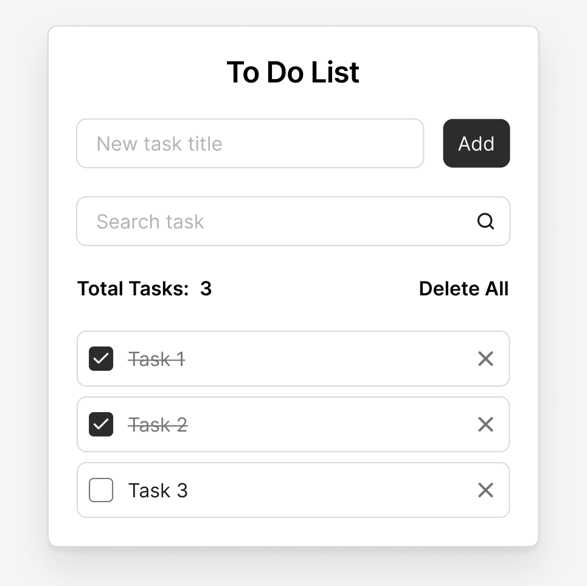

# 📝 To Do List на чистом JavaScript

Простое, минималистичное приложение "To Do List", написанное **без фреймворков и библиотек** — только **HTML**, **CSS** и **Vanilla JS**.

Цель проекта — показать, как можно реализовать полноценное интерактивное приложение, используя только нативные возможности браузера. Это учебный пример для начинающих фронтендеров и тех, кто хочет лучше понять работу с DOM и `localStorage`.

## 📸 Дизайн

Интерфейс взят из бесплатного макета Figma. Выглядит чисто и понятно:

## ⚙️ Возможности

- ✅ Добавление новой задачи (через отдельное поле)
- ✅ Поиск по текущим задачам (в реальном времени)
- ✅ Отметка задачи как выполненной
- ✅ Удаление одной задачи
- ✅ Удаление всех задач
- ✅ Счётчик количества задач
- ✅ Сохранение всех данных в `localStorage`
- ✅ Поддержка Enter-клавиши и автофокуса

## 💡 Стек

- **HTML5**
- **CSS3**
- **JavaScript (ES6+)**  
  Без сборщиков, библиотек, фреймворков или внешних зависимостей

